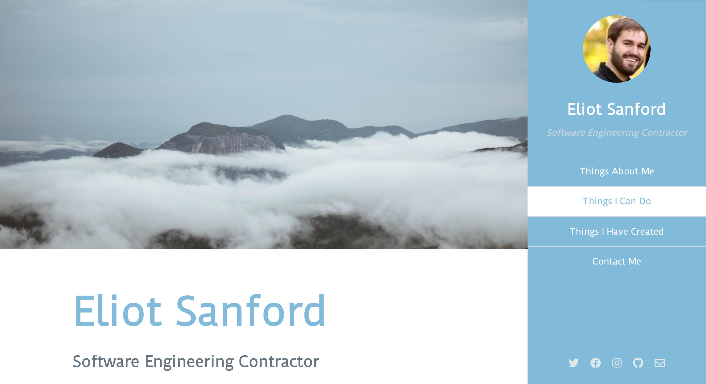
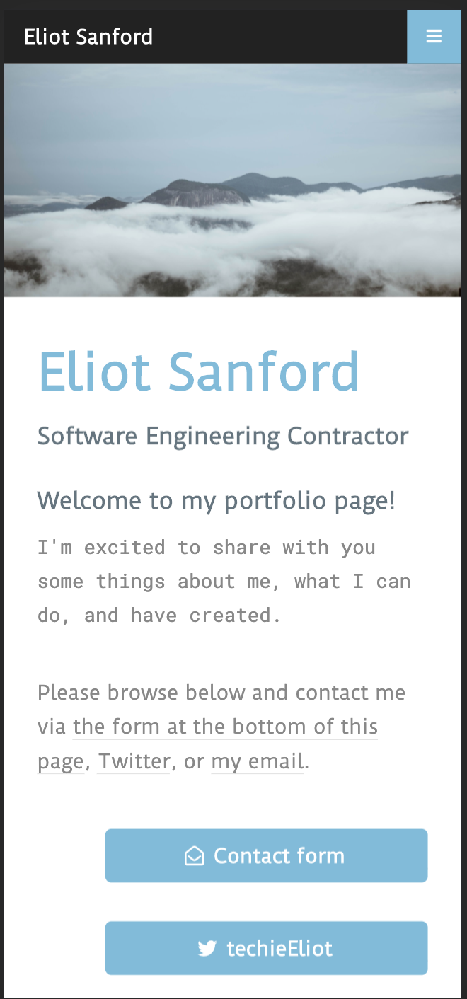

# Eliot Sanford's Portfolio

The following page is my portfolio for all my projects and lists my resume. The site is a simple single-page responsive design. Includes a contact form via formspree.io, pre-styled elements, and Sass sources. Please contact me. I'm for hire.

[Live link](https://techieeliot.github.io/Eliot-Sanford-Portfolio/)

## Screenshots

### _Landing Page_

_Desktop Landing_

_Mobile Landing_

## Technologies Used

### Languages and Frameworks

    	* HTML
    	* CSS
    	* Bootstrap
    	* jQuery (jquery.com)

### API (none used)

    	* API [Documentation](url)

## Photos

    	* Courtesy of Unsplash (unsplash.com), the best place to find free open-source photos.

Please offer report any feedback to me via Pull Request and/or Twitter dm @techieeliot.

Thanks for reading thus far,
Eliot Sanford

## Credits:

### Template

    	* Read Only by HTML5 UP
    	* html5up.net | @ajlkn

### Icons:

    	Font Awesome (fontawesome.io)

### Other:

    	Scrollex (github.com/ajlkn/jquery.scrollex)
    	Responsive Tools (github.com/ajlkn/responsive-tools)
